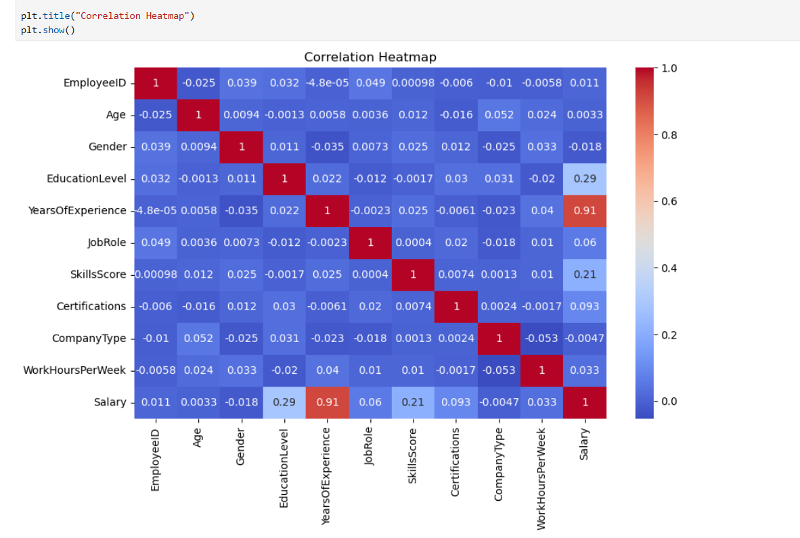

# \# 💼 Employee Salary Prediction System

## 

#### \## 📌 Overview


The \*\*Employee Salary Prediction System\*\* is a Machine Learning project developed as part of the \*\*Infobharat Interns Machine Learning Internship Program\*\*.


This project predicts an employee's annual salary based on factors such as:


\* Age

\* Education Level

\* Years of Experience

\* Job Role

\* Skills Score

\* Certifications

\* Company Type

\* Weekly Working Hours


The system demonstrates a complete Machine Learning workflow including data generation, preprocessing, exploratory data analysis, visualization, model training, evaluation, model comparison, and salary prediction.


\---


#### \## 🎯 Project Objectives


✔ Generate a realistic employee dataset containing 2000+ records


✔ Perform data preprocessing and validation


✔ Analyze salary trends using Exploratory Data Analysis (EDA)


✔ Visualize important salary-related patterns


✔ Train multiple Machine Learning regression models


✔ Compare model performance


✔ Predict employee salaries using a trained model


\---


#### \## 🗂 Dataset Features


| Feature           | Description                                                |

| ----------------- | ---------------------------------------------------------- |

| EmployeeID        | Unique Employee Identifier                                 |

| Age               | Employee Age                                               |

| Gender            | Male / Female                                              |

| EducationLevel    | Bachelor / Master / PhD                                    |

| YearsOfExperience | Total Years of Experience                                  |

| JobRole           | Developer, Data Analyst, Manager, Designer, Data Scientist |

| SkillsScore       | Technical Skill Rating (1–10)                              |

| Certifications    | Number of Certifications                                   |

| CompanyType       | Startup / MNC / Medium Scale                               |

| WorkHoursPerWeek  | Weekly Working Hours                                       |

| Salary            | Annual Salary (Target Variable)                            |


\---

#### 

#### \## 🛠 Technologies Used


\* Python

\* Jupyter Notebook

\* Pandas

\* NumPy

\* Matplotlib

\* Seaborn

\* Scikit-Learn

\* Pickle


\---


#### \## ⚙ Data Preprocessing


The following preprocessing techniques were applied:


\* Handling Missing Values

\* Removing Duplicate Records

\* Label Encoding of Categorical Features

\* Feature Scaling using StandardScaler

\* Data Validation


\---


#### \## 📊 Exploratory Data Analysis (EDA)


###### \### Experience vs Salary Analysis


Identified the relationship between employee experience and salary growth.

###### 

###### \### Education Level Impact


Analyzed how educational qualifications influence salary.


###### \### Job Role Analysis


Compared average salaries across different job roles.


###### \### Correlation Analysis


Examined relationships between numerical features using a heatmap.


\---


#### \## 📈 Visualizations

###### 

###### \### 1️⃣ Experience vs Salary Scatter Plot


Shows the positive relationship between work experience and salary.


###### \### 2️⃣ Average Salary by Job Role


Compares average salaries among different job positions.

###### 

###### \### 3️⃣ Correlation Heatmap


Displays correlations among numerical features.


###### \### 4️⃣ Salary Distribution by Education Level


Illustrates salary variation across educational qualifications.


\---


#### \## 🤖 Machine Learning Models


The following regression models were implemented and compared:


| Model                   | Purpose                     |

| ----------------------- | --------------------------- |

| Linear Regression       | Baseline Regression Model   |

| Decision Tree Regressor | Tree-Based Prediction Model |

| Random Forest Regressor | Ensemble Learning Model     |


\---


#### \## 🏆 Model Comparison


Models were evaluated using:


\* MAE (Mean Absolute Error)

\* RMSE (Root Mean Squared Error)

\* R² Score


#### \### Final Model Selected


###### ✅ \*\*Random Forest Regressor\*\*


\### Why Random Forest?


\* Highest prediction accuracy

\* Better generalization capability

\* Lowest prediction error

\* Handles complex relationships effectively


\---


###### \## 📂 Project Structure


```text

Employee_Salary/

├── Employee_Salary_Prediction.ipynb
├── employee_salary.csv
├── Salary_prediction.py
├── README.md
├── Requirements.txt
├── Dataset.png
├── heatmap.png
├── model_r2score.png
└── other project screenshots

```


\---

###### 

###### \## 🚀 How to Run the Project

## 📌 Note

The trained model file (`salary_model.pkl`) is not included in this repository.

To generate the model file, run all cells in `Employee_Salary_Prediction.ipynb`. The notebook will train the model and save the trained model for salary prediction.


\### Step 1: Install Dependencies


```bash

pip install pandas numpy matplotlib seaborn scikit-learn

```


\### Step 2: Open Jupyter Notebook


Run all cells in:


```text

EMP\_SAL.ipynb

```


\### Step 3: Train the Model


Execute all notebook cells to:


\* Load the dataset

\* Preprocess data

\* Train models

\* Compare performance

\* Save the best model


\### Step 4: Run Salary Predictor


```bash

python Salary\_predictor.py

```


\### Step 5: Enter Employee Details


Provide:


\* Age

\* Gender

\* Education Level

\* Years of Experience

\* Skills Score

\* Certifications

\* Job Role

\* Company Type

\* Work Hours Per Week


The trained model will predict the employee's estimated annual salary.


\---


#### \## 📌 Key Insights


\* Salary generally increases with experience.

\* Higher educational qualifications often result in higher salaries.

\* Employees with better skill scores tend to earn more.

\* Certifications positively impact salary growth.

\* Job role significantly influences compensation.

\* Random Forest Regressor provides the most accurate predictions.


\---


#### \## 🔮 Future Enhancements


\* Streamlit Web Application

\* Feature Importance Visualization

\* Hyperparameter Tuning

\* Cloud Deployment

\* Interactive Dashboard

\* Real-Time Salary Prediction Interface


\---


#### \## 📷 Project Screenshots


Add screenshots of:


\* Dataset Preview

\* Correlation Heatmap

\* Experience vs Salary Plot

\* Model Comparison Results

\* Salary Prediction Output


Example:


```md



```


\---


#### \## 👩‍💻 Author


\*\*Gaddamedhi Varsha\*\*


Machine Learning Intern


Employee Salary Prediction System


Info Bharat Interns (IBI)


\---


###### \## ⭐ Support


If you found this project useful:


⭐ Star the repository


🍴 Fork the repository


📢 Share it with others


\---


## \### Thank You for Visiting This Project!

